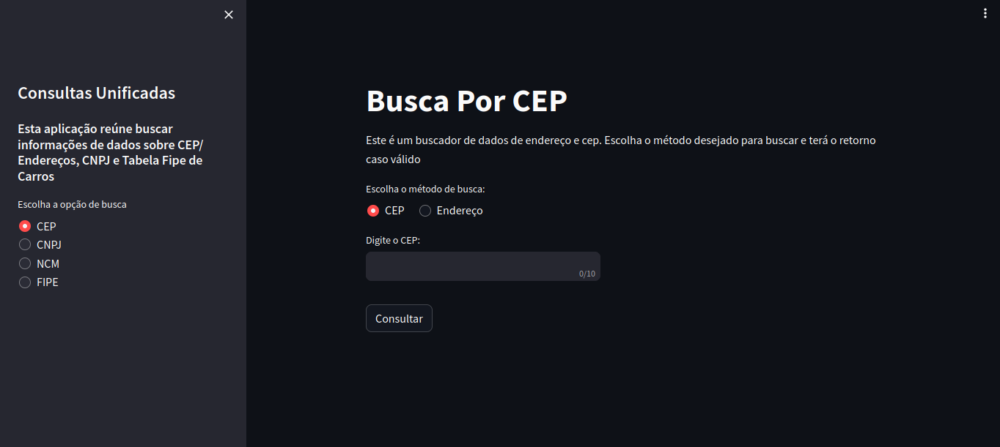

<h1 align="center"> :rocket: Consumer-api-app </h1>


## :ledger: Descrição

Esta aplicação é um WebApp simples, contruído totalmente em Python, em que consiste em realizar pesquisas de CEP/Endereço, CNPJ de empresas, Código NCM de produtos e informações de veículos pela Tabela FIPE, tudo por meio da integreação e consumo de API's.

## 🧱 Stack utilizada

<div style="display:inline_block">
  
  
</div>

## :bulb: Funcionalidades

- Busca de endereço pelo número do cep ou encontrar o número de cep pelos dados da Rua/Avenina
- Encontrar informações de empresa por meio do CNPJ
- Obter dados sobre produtos comercializados no Brasil por meio do código NCM ou descrição do produto
- Consultar informações e valores de preço de veículos atualizadas com mês referência da Tabela FIPE

## 📦 Recursos Externos

Para a construção dessa aplicação, foram utilizados API's para realização das consultas. São elas:
- Consulta de CEP e Endereço - APi disponibilizada pela <a href="https://viacep.com.br/" target="_blank">:link:Via Cep</a>
- Consulta ao CNPJ - API pública disponível em <a href="https://receitaws.com.br/" target="_blank">:link:Receita WS</a>
- NCM de produtos - API disponibilizada pela <a href="https://brasilapi.com.br/" target="_blank">:link:BrasilAPI</a>
- Tabela Fipe - API fornecida por <a href="https://deividfortuna.github.io/fipe/v2" target="_blank">:link:Deivid Fortuna</a>

## :bar_chart: Status da Aplicação

Atualmente a aplicação encontra-se na versão v1, em que contém 4 funcionalidades para consumo e consulta de dados por API's.

## :wrench: Instalação e rodando localmente

Para rodar localmente, primeiro Clone o projeto para seu computador:

```bash
git clone https://github.com/thercior/consumer-api-app.git
```

Entre no diretório do projeto

```bash
  cd my-project
```

Crie e ative o ambiente virtual

```bash
python -m venv venv
venv\Scripts\activate # Para Windows
source venv/bin/activate # Para Linux
```

Instale as dependências do projeto, rodando o comando:

```bash
pip install -r requirements.txt
```

Rode o servidor da aplicação com:

```bash
streamlit run app.py
```

## :rocket: Deploy

Foi feito o deploy da aplicação no próprio cloud do Streamlit, e você pode verificar e testar a aplicação em servidor online por deste link <a href="https://consumer-api.streamlit.app/" target="_blank">:link: Consumer-api-app</a>

##  :pencil: Licença
Consumerr-api-app está sobre uma <a href="./LICENSE">:link:Licença MIT</a>.
